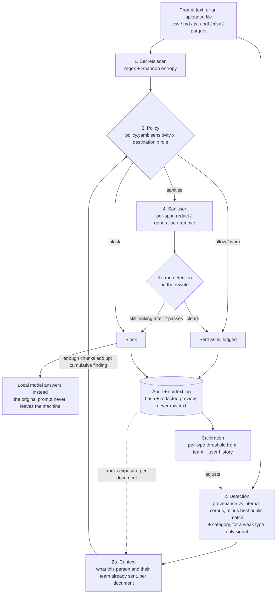

# ndAI

**The NDA your AI assistant actually reads.**

ndAI checks what an employee is about to paste or upload to an external AI
tool, such as ChatGPT, Claude, or Gemini, before it leaves their computer. It
recognizes the company's own confidential material, not just credit card
numbers or passwords, and either lets the message through, rewrites it to
remove the sensitive part, or blocks it. The check runs locally; nothing is
sent anywhere until it passes.

---

## The problem

Most tools that check what employees send to AI assistants only catch two
things: known patterns like credit card numbers, and generic categories like
"this looks like source code" or "this looks financial." Neither answers the
question that actually matters:

> Is this the company's own confidential information?

A generic category check cannot tell a researcher discussing their field in
general from a researcher describing an unpublished result. That gap is
where real leaks happen.

## How ndAI is different

ndAI compares what someone is about to send against the company's own
internal documents, not against generic categories. It also checks the same
text against publicly known material in the same field, so it does not flag
normal industry language. Skip that second check and a detector trained on,
say, an oncology corpus ends up flagging almost everything an oncologist
writes, which makes it unusable and gets it turned off.

Depending on how sensitive the content is and where it is headed, ndAI:

- **Allows** it, when nothing sensitive is present or the destination is trusted.
- **Warns and logs** it, when it is worth a compliance record but not worth blocking.
- **Rewrites** it, keeping the actual question or task but removing the confidential specifics.
- **Blocks** it, and offers to answer the question with a local model instead, so the employee is not left stuck.

It also recognizes when a document is being leaked a piece at a time across
several prompts, or across several people on a team, which a tool that only
looks at one message at a time would miss.

## Limitations

**A rewrite cannot help when the confidential content is the actual
question**, for example asking an outside AI to verify a proprietary
calculation. There is no way to remove the sensitive part without removing
the question. ndAI recognizes this and blocks instead of producing a rewrite
that would not be useful anyway.

**Removing specific numbers or names is not enough on its own.** "[Company]
will acquire [Target] for [Amount]" still reveals that a confidential
acquisition is happening. For the most sensitive material, ndAI removes the
fact entirely instead of trying to paraphrase around it. For less sensitive
material, it rewrites the request to stay useful without the confidential
specifics.

**This does not stop deliberate misuse**, and it does not resolve what an AI
vendor may or may not do with data under contract. It stops accidental
disclosure: the pasted config file, the draft board memo, the internal
spreadsheet.

**Tracking who already sent what relies on declared teams, not guesswork.**
It never infers a person's role or team from what they type, since that
would let a repeated leak define itself as normal.

**It checks what is typed, pasted, or uploaded, not everything a browser
extension could technically intercept.** This is deliberate: deeper
interception breaks the host website every time it updates, and a tool that
breaks ChatGPT gets uninstalled.

**It checks against a known-public snapshot, not a live web search.** A
recent public announcement might not yet be recognized as public, producing
a false alarm on genuinely public information. A live lookup would fix
that, but it means every check calls out to the internet before a decision
is made, which conflicts with the "nothing leaves this machine" guarantee
and creates a new way information could leak, through the search query
itself.

---

## How it works



Every check runs through the same stages: scan for known-format items like
passwords first, compare the text against internal and public material,
check whether this person or their team has already sent related material
recently, then apply a policy based on sensitivity, destination, and role.
A rewrite is never trusted blindly; it is checked again before it is sent,
and escalated to a blunter edit, then blocked, if it still matches. A block
is not a dead end either: the untouched prompt can be answered by a local
model instead, so the employee still gets an answer.

The check works on individual sentences, or individual rows for a
spreadsheet, not the message as a whole. A long message with one sensitive
line is not diluted by everything else around it.

Nothing here depends on the content of past messages. The log only ever
stores which document, which section, and a hash and short redacted
preview, never the original text. That same log is what lets ndAI's
thresholds adjust over time, based on this organisation's own history,
instead of staying fixed.

---

## Getting started

```bash
python -m venv .venv && source .venv/bin/activate
pip install -r requirements.txt

ollama pull qwen2.5:3b-instruct   # local model used for rewrites and local-only answers

python -m detector.main          # starts the service at http://127.0.0.1:8000
python demo_seed.py              # adds a few example events so the dashboard has something to show

cd dashboard && npm install && npm run dev   # http://localhost:5173
```

Then build the browser extension:

```bash
cd extension && npm install && npm run build   # TypeScript -> extension/dist/
npm run preview                                # a sample chat page for testing: http://localhost:8787/preview/
```

Load `extension/` at `chrome://extensions` with Developer mode on, click the
ndAI icon, and select **Activate ndAI**. Typing or pasting something from
`corpus/internal/` into ChatGPT should trigger a response. Uploading a PDF
or text file holds it, shows a review page, and only sends a sanitized copy
once every proposed change has been approved. In the sample chat page, use
**+ sample board-memo.pdf** to try this.

Document extraction and the sanitized preview in the extension are
currently front-end mocks (`extension/src/review/mock_sanitizer.ts`) until
they are wired to the real backend. The extension uses an in-browser mock
detector by default; set `DETECTOR_MODE = "live"` in
`extension/src/config.ts` to use the local service instead.

### Running without `sentence-transformers`

If the real embedding model is not installed, ndAI falls back to a simple
text-matching mode. It still runs, but it can only recognize an exact or
near-exact copy, not a reworded version of confidential text. Every part of
the product says so clearly: a warning in the logs, `/health` reporting
`semantic: false`, a notice in the extension and the dashboard. Do not use
this mode for a demo or an evaluation of accuracy.

---

## Evaluation

```bash
python -m eval.run_eval
python -m eval.check_contract     # single-prompt acceptance scenarios
python -m eval.check_context      # multi-prompt leaks, and cases that must not trigger a false alarm
```

Compares three approaches on the same labelled examples: a simple pattern
scanner, a generic category classifier, and ndAI's full check. Reports how
much each one catches, and how often each one raises a false alarm.

Two numbers matter more than overall accuracy:

1. **How much of a reworded, not copy-pasted, leak it catches.** Catching an exact copy is the easy case.
2. **How often it raises a false alarm on genuinely public material on the same subject.** A detector that cannot tell the difference has only learned the topic, not the company's ownership of it.

`eval/dataset.py` currently holds 56 labelled examples. This should grow to
200 or more before the numbers are quoted with confidence, keeping roughly
a third of the set as genuinely public material that must not trigger a
false alarm.

Two smaller test suites check the rest of the system against hand-built
examples, independent of the real embedding model: `eval/response_fixtures.py`
for policy decisions, and `eval/calibration_fixtures.py` for the threshold
adjustment. `eval/sanitiser_eval.py` reports the rewrite step's own numbers:
how much of the leak is removed, how much of the original intent is kept,
and how fast it runs.

---

## Project layout

```
detector/         local inspection service (FastAPI, 127.0.0.1 only)
  secrets_scan     stage 1, patterns and entropy
  detection        stage 2, text in, DetectionResult out (CONTRACT.md)
  provenance       company-specific matching against the corpus. the novel part
  categories       prototype embeddings, weak fallback signal, no training
  context          stage 2b, per-person and per-team exposure, the context graph
  calibration      per-type threshold adjustment from team + user audit history
  policy           stage 3, evaluates policy.yaml
  ingest           file to text chunks: csv / md / txt / pdf / xlsx / parquet
  pipeline         wires the stages above together
  rewrite          local model access for the block path
  audit            SQLite log, hashes and redacted previews, not raw text
                   (context_edges sits beside it: doc, chunk, score, never text)
sanitiser/         stage 4, per-span rewrite with a re-detection verification loop
extension/         Chrome MV3, TypeScript, file upload and a review UI
dashboard/         Vite + React, live stream, context graph, and the three-way comparison
eval/              labelled dataset and metrics harnesses
corpus/internal    fake company confidential material
corpus/public      hard negatives, same field, public sources
policy.yaml        the rules, readable by a security lead
CONTRACT.md        the DetectionResult schema, type taxonomy, sensitivity rubric
```

The audit log stores a hash and a redacted preview, never the prompt.
Keeping raw text would build one database holding every confidential thing
anyone nearly leaked, which is the exposure this product exists to prevent.

---

## Roadmap

1. Grow the evaluation set to 200+ examples and re-tune thresholds against it.
2. Pull the reference corpus from a real source (a shared drive, Confluence, a repo) instead of a folder, updating incrementally.
3. Highlight the specific line that triggered a response in the extension, instead of a verdict on the whole message.
4. An approval workflow for blocked requests: ask for an exception, route to a reviewer.
5. Coverage beyond the browser: a proxy that also covers IDE assistants and command-line tools.
6. Produce an edited, downloadable copy of an uploaded spreadsheet, not just a decision and preview per row.
7. Show calibration and per-user history in the dashboard directly, instead of only through the API.
