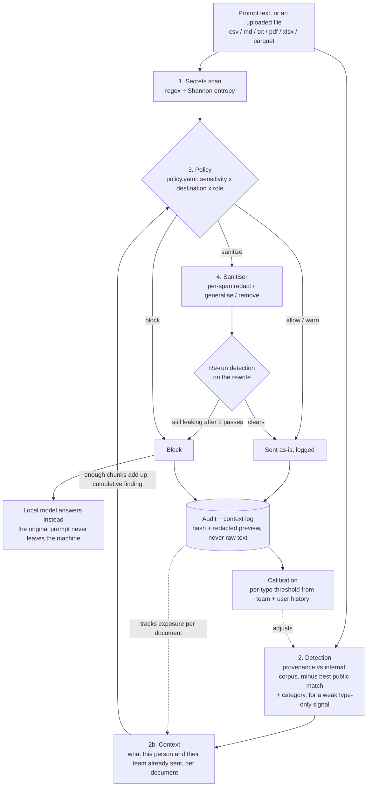

# ndAI

A local semantic firewall for AI prompts. It checks what an employee is about to
send to an external AI assistant, decides using company-specific knowledge rather
than pattern matching, and either allows it, rewrites it to the minimum necessary
context, or stops it. The check runs on the employee's machine.

**The NDA your AI assistant actually reads.**

---

## What is actually new here

Pattern-based DLP catches credentials and PII. Semantic DLP products catch
categories: "this looks like source code", "this looks financial". Neither
answers the question that matters to a research lab:

> Is this text derived from *our* confidential material?

ndAI answers that with a local provenance index over the company's own
documents, and it does it against a second index of public material in the same
field. That second index is the part most people skip. Without it, a detector
built on an oncology corpus flags every sentence a biologist writes about
oncology, the false positive rate makes the tool unusable, and people turn it off.

Everything else in this repo (policy engine, sanitiser, dashboard) is scaffolding
around that one claim, and `eval/` exists to test it.

---

## Setup

```bash
python -m venv .venv && source .venv/bin/activate
pip install -r requirements.txt

# Pull the local rewrite model. Do this before the hackathon wifi does.
ollama pull qwen2.5:3b-instruct

python -m detector.main          # http://127.0.0.1:8000
python demo_seed.py              # populate the audit log

cd dashboard && npm install && npm run dev   # http://localhost:5173
```

Then build the extension and load it:

```bash
cd extension && npm install && npm run build   # TypeScript -> extension/dist/
npm run preview                                # fake chat page: http://localhost:8787/preview/
```

Load `extension/` at `chrome://extensions` with Developer mode on, click the
NDAi toolbar icon, press **Activate NDAi**, and type or paste something from
`corpus/internal/` into ChatGPT. Uploading a PDF or text file holds the upload,
shows a notice with a link to the extension's review page, and only sends a
sanitized copy once every proposed change has been approved or kept. In the
preview, use **+ sample board-memo.pdf**. Document extraction and the sanitized
output are front-end mocks (`extension/src/review/mock_sanitizer.ts`) until the
backend provides them. The extension uses an in-browser mock detector
by default (`extension/src/config.ts`); set `DETECTOR_MODE = "live"` to call the
local service instead.

### If you skip `sentence-transformers`

The embedder falls back to character n-gram hashing. It runs, the plumbing works,
and paraphrase detection is **off**. Every surface says so: the service logs a
warning, `/health` returns `semantic: false`, the extension toasts, the dashboard
shows it. Never demo on the fallback.

---

## Architecture



Detection scores **per sentence** (or per row, for a spreadsheet), not per
prompt or per file. A 500-word prompt with two leaked lines averages down to
nothing if you embed the whole thing at once.

The context stage catches a document that leaks a piece at a time, where each
piece alone is too small or too reworded to trip detection on its own. It
remembers which sections of which internal documents already reached a given
destination class, per person and per declared team, and adds a `cumulative`
finding when the current prompt completes enough of one document. It stores
corpus references (document, chunk, score), never prompt text. The dashboard
draws the result as a graph: teams, people, documents, destinations. Rules and
thresholds live in `CONTRACT.md` §9.

Risk is never a property of the text alone. The same paragraph is fine going to
the internal model, logged going to a vendor under contract, and blocked going to
a personal ChatGPT account. That lives in `policy.yaml` so a security lead can
read it without reading Python.

A `sanitize` decision does not mean the rewrite is trusted: the sanitiser
re-runs detection on its own output and escalates to a blunter edit if the
rewrite still matches, failing closed to `block` after two passes. A `block`
decision is not a dead end either: the untouched prompt is answered by the
local model instead, so the block path still gets the person an answer.
Every decision (never the raw prompt) is logged, and that log is what
calibration reads to adjust detection's per-type threshold over time.

---

## Limits we state out loud

**Rewriting cannot save a reasoning task.** If the confidential content is
*context* for the task (help me structure this, clean up this draft), a minimum
context rewrite preserves the help. If the confidential content *is* the problem
(verify this proof step, why does this assay result look wrong), no rewrite
preserves the task. `sanitiser/planner.py` detects this case and blocks rather
than producing something useless. The honest answer there is the internal model.

**Placeholders are not protection for the material they stand in for.**
"[COMPANY] will acquire [TARGET] for [AMOUNT]" still discloses that there is a
secret acquisition. The sanitiser only uses a placeholder for a near-verbatim
match at a high sensitivity tier, where the safe move is to cut the fact
entirely rather than attempt a paraphrase that might still leak it. Anything
weaker than that gets a real rewrite that changes what is being asked, not
just the nouns.

**This does not stop a frontier lab from competing with its customers.** That is
a contract and jurisdiction problem. ndAI stops the accidental disclosure:
the pasted `.env`, the draft board memo, the internal schema. Say so in the pitch
before a judge says it for you.

**History adds up evidence; it does not define confidential.** The context
stage only counts matches against documents the corpus already marks internal,
and teams come from `policy.yaml`, not from what people type. Learning either
from prompts would let a repeated leak become normal. Near misses feed it, so it
records some noise. It takes distinct sections across distinct prompts before
anything escalates.

**Interception is shallow on purpose.** Paste and send, not `fetch` monkey
patching. Deeper hooks catch more and break the host page every time it ships a
change, and a tool that breaks ChatGPT gets uninstalled the same week.

**Research freshness is local-only for now.** The public corpus is built in
advance, not fetched live, so a paper published after the corpus was last
refreshed won't be recognized as already-public, a false positive on
genuinely public research. Live web lookup at inspection time would fix that,
but it means the detector calls out to the internet before a decision is made:
the opposite of "nothing leaves this machine until you approve it," and a new
leak surface in its own right (the query itself discloses what you're asking
about). Worth revisiting once the static-corpus approach is proven; not in
scope for v1.

---

## Evaluation

```bash
python -m eval.run_eval
python -m eval.check_contract     # single-prompt acceptance scenarios
python -m eval.check_context      # multi-prompt leaks, and harmless runs that must not add up
```

Three systems on the same labelled prompts: pattern scanner, generic category
classifier, full pipeline. Reports recall by class and false positive rate by
class.

Only two numbers decide whether this works:

1. **Paraphrase recall.** Verbatim detection is trivial. Anyone can do it.
2. **False positive rate on `public_domain`.** These are hard negatives: the same
   subject matter written from public sources. A detector that flags them has
   learned the topic, not the provenance.

`eval/dataset.py` ships 56 labelled prompts. Expand to 200+ before quoting
numbers, and keep the class balance: hard negatives should be roughly a third
of the set.

Thresholds in `config.py` are tuned for the sentence-transformers backend. They
need re-tuning if you change the embedding model or the corpus.

Two smaller harnesses validate the other stages against hand-written
fixtures, independent of the real embedding backend: `eval/response_fixtures.py`
for policy decisions, and `eval/calibration_fixtures.py` for the threshold
adjustment direction and bounds. `eval/sanitiser_eval.py` reports the
sanitiser's own numbers (leak clearance, intent retention, latency) against
the same 56-prompt dataset.

---

## Layout

```
detector/         local inspection service (FastAPI, 127.0.0.1 only)
  secrets_scan     stage 1, patterns and entropy
  detection        stage 2, text in, DetectionResult out (CONTRACT.md)
  provenance       company-specific matching against the corpus. the novel part
  categories       prototype embeddings, weak fallback signal, no training
  context          stage 2b, per-person and per-team exposure, the context graph
  calibration      per-type threshold adjustment from team + user audit history
  policy           stage 3, evaluates policy.yaml
  ingest           file to text chunks: csv / md / txt / pdf / xlsx / parquet
  pipeline         wires the stages above together
  rewrite          local model access for the block path
  audit            SQLite log, hashes and redacted previews, not raw text
                   (context_edges sits beside it: doc, chunk, score, never text)
sanitiser/         stage 4, per-span rewrite with a re-detection verification loop
extension/         Chrome MV3, intercepts paste and send
dashboard/         Vite + React, live stream, context graph, and the three-way comparison
eval/              labelled dataset and metrics harnesses
corpus/internal    fake company confidential material
corpus/public      hard negatives, same field, public sources
policy.yaml        the rules, readable by a security lead
CONTRACT.md        the DetectionResult schema, type taxonomy, sensitivity rubric
```

The audit log stores a SHA-256 and a redacted preview, not the prompt. Keeping
raw text would build one database holding every confidential thing anyone nearly
leaked, which is the exposure this product exists to prevent.

---

## Next, in rough order of value

1. Expand `eval/dataset.py` to 200+ prompts and re-tune thresholds on the results.
2. Corpus ingestion from a real source (Drive, Confluence, a repo) instead of a
   folder, with incremental re-indexing.
3. Per-sentence highlighting in the extension, so the user sees which line tripped
   it rather than a verdict on the whole paste.
4. Approval workflow for `block`: request an exception, route to a reviewer.
5. Forward proxy build for coverage beyond the browser (IDE assistants, CLI tools).
6. Reconstruct a rewritten, downloadable file from the sanitiser's per-row
   edits on a csv/xlsx upload. Today `/inspect/file` reports a decision and a
   sanitised preview per row, not an edited copy of the original file.
7. Surface `/calibration` and per-user profile in the dashboard, so a security
   lead can see why a threshold moved without calling the API directly.
