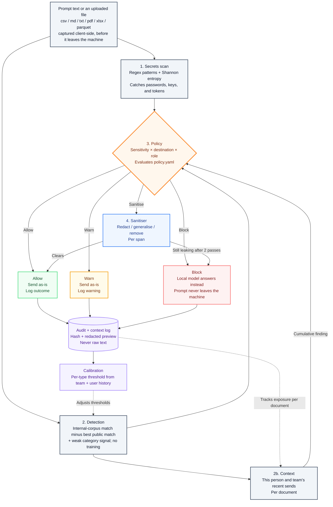

# ndAI (NDA + AI)

ndAI checks what an employee pastes, types or uploads into an AI tool
(ChatGPT, Claude, Gemini) before it is sent. It recognises the company's own
confidential material, then allows, warns, rewrites or blocks. The check runs
on the employee's machine.

## Why

Existing tools catch fixed patterns (card numbers, passwords) and generic
categories ("looks financial"). Neither answers the real question: is this
*our* confidential information? ndAI compares text against the company's
internal documents and against public material on the same subjects. Text
counts as confidential only when it is clearly closer to the internal version.
Without the public comparison, a detector flags everyone who talks about their
own field.

## What it does

- **Matches company material**, including reworded text.
- **Scans for secrets**: API keys, passwords, personal data.
- **Catches leaks in pieces**: one document sent across several messages or several people on a team.
- **Applies readable rules**: `policy.yaml` decides by sensitivity, destination and role.
- **Rewrites safely**: removes only the confidential part, then re-checks the result.
- **Checks files**: csv, md, txt, pdf, xlsx, parquet, row by row or page by page.
- **Tunes itself**: adjusts strictness per document type from its own history.
- **Keeps no prompt text**: the log holds decisions, document references and hashes.

## How it works



Each sentence (or file row) is checked separately, so one sensitive line in a
long message is not diluted.

- **1. Secrets scan.** Pattern and entropy checks for keys, passwords and
  personal data. A live credential is always blocked.
- **2. Detection (company material).** Each sentence is compared with internal
  and public documents. A match records the source document and its tier:
  public, internal, confidential or restricted.
- **2b. Context (leaking in pieces).** ndAI records which sections of each
  internal document a person and their team sent out in the last 14 days. If
  this message completes enough of one document, it is flagged, even if no
  single message was. Teams come from `policy.yaml`, never from what people
  type.
  > Dana sends Gemini a vague line about buying a company: allowed. Dana later
  > sends a line about the seller's lawsuit. Together that is 2 of 6 sections
  > of the restricted acquisition memo: blocked. The same applies if Alex, on
  > the same team, sends the second line.
- **3. Policy.** Sensitivity against destination:

  | Content | Company's own model | Approved vendor | Consumer AI |
  |---|---|---|---|
  | Public or internal | Allow | Allow | Allow |
  | Confidential | Allow | Warn | Rewrite |
  | Restricted | Allow | Rewrite | Block |

  Also: topic-only guesses (no matching document) at most warn; contractors
  are warned on anything internal.
- **4. Sanitiser (rewrite).** Only flagged sentences are edited (detail
  removed, sentence generalised or dropped). The result is checked again; if
  it still matches, a stronger edit is tried, then it is blocked after two
  attempts. If the confidential part is the question itself ("check this
  calculation"), it is blocked immediately.

On block, nothing is sent. The service can answer locally instead
(`POST /local-answer`); the extension does not offer this yet.

The log stores the decision, the matched document and section, a hash and a
redacted preview, never the original text. Step 3 reads it to track exposure,
and calibration reads it to adjust per-type thresholds. Calibration never
changes roles or clearance.

## Limitations

- **A rewrite cannot help when the confidential content is the question.** ndAI blocks instead.
- **Masking names is not enough.** "[Company] will acquire [Target]" still reveals an acquisition, so restricted material is removed, not paraphrased.
- **It stops accidental disclosure, not deliberate misuse,** and does not govern what an AI vendor does with data.
- **Interception is limited to typing, pasting and uploads.** Deeper hooks break the host site on every update.
- **The public corpus is a snapshot, not a live search.** Recent public news may be flagged. A live lookup would send data out before the decision, which defeats the purpose.

## Getting started

```bash
python -m venv .venv && source .venv/bin/activate
pip install -r requirements.txt
ollama pull qwen2.5:3b-instruct   # local model for rewrites and local answers

python -m detector.main           # service at http://127.0.0.1:8000
python demo_seed.py               # example events, including a cumulative one
```

Extension:

```bash
cd extension && npm install && npm run build   # builds extension/dist/
npm run preview                                # test chat page at http://localhost:8787/preview/
```

Load `extension/` at `chrome://extensions` (Developer mode), click the ndAI
icon, then **Activate ndAI**. Paste text from `corpus/internal/` into ChatGPT
to trigger a check. Uploaded files open a review page and are sent only after
every change is approved.

Notes:

- The extension calls the local service by default. Set `DETECTOR_MODE = "mock"` in `extension/src/config.ts` to run without it.
- PDF/DOCX text extraction is still simulated (`extension/src/review/mock_sanitizer.ts`): PDFs use sample text and return a placeholder `.txt`.
- Without `sentence-transformers`, ndAI falls back to exact-match mode and cannot catch reworded text. `/health` reports `semantic: false`. Do not demo or evaluate in this mode.

## Evaluation

```bash
python -m eval.run_eval              # pattern scanner vs category classifier vs ndAI
python -m eval.check_contract        # single-prompt acceptance scenarios
python -m eval.check_context         # multi-prompt leaks, and prompts that must not add up
python -m eval.sanitiser_eval        # rewrite: leak removed, intent kept, latency
python -m eval.response_fixtures     # policy decisions, no model needed
python -m eval.calibration_fixtures  # threshold tuning, no model needed
```

Two numbers matter most:

1. **How many reworded leaks it catches.** Exact copies are easy.
2. **False alarms on public material about the same subject.** Flagging these means the detector learned the topic, not the ownership.

`eval/dataset.py` has 56 examples. Grow it to 200+, about a third public
material, before quoting numbers.

## Project layout

```
detector/         local inspection service (FastAPI, 127.0.0.1 only)
  secrets_scan     stage 1, patterns and entropy
  detection        stage 2, text in, DetectionResult out (CONTRACT.md)
  provenance       company-specific matching against the corpus. the novel part
  categories       prototype embeddings, weak fallback signal, no training
  context          stage 2b, per-person and per-team exposure, the context graph
  calibration      per-type threshold adjustment from team + user audit history
  policy           stage 3, evaluates policy.yaml
  ingest           file to text chunks: csv / md / txt / pdf / xlsx / parquet
  pipeline         wires the stages above together
  rewrite          local model access for the block path
  audit            SQLite log, hashes and redacted previews, not raw text
                   (context_edges sits beside it: doc, chunk, score, never text)
sanitiser/         stage 4, per-span rewrite with a re-detection verification loop
extension/         Chrome MV3, TypeScript, file upload and a review UI
eval/              labelled dataset and metrics harnesses
corpus/internal    fake company confidential material
corpus/public      hard negatives, same field, public sources
policy.yaml        the rules, readable by a security lead
CONTRACT.md        the DetectionResult schema, type taxonomy, sensitivity rubric
```

## Roadmap

1. Grow the evaluation set to 200+ examples and re-tune thresholds.
2. Load the corpus from a real source (shared drive, Confluence, a repo) with incremental updates.
3. Approval workflow for blocks: request an exception, route to a reviewer.
4. Coverage beyond the browser: a proxy for IDE assistants and CLI tools.
5. Return an edited copy of uploaded files, not just a decision per row.
6. Surface calibration and per-user history somewhere a person can see it (`/calibration`, `/users/{user}/profile` exist, nothing renders them yet).
7. Real PDF/DOCX text extraction in the backend.
8. Offer the local answer in the extension when a message is blocked.
